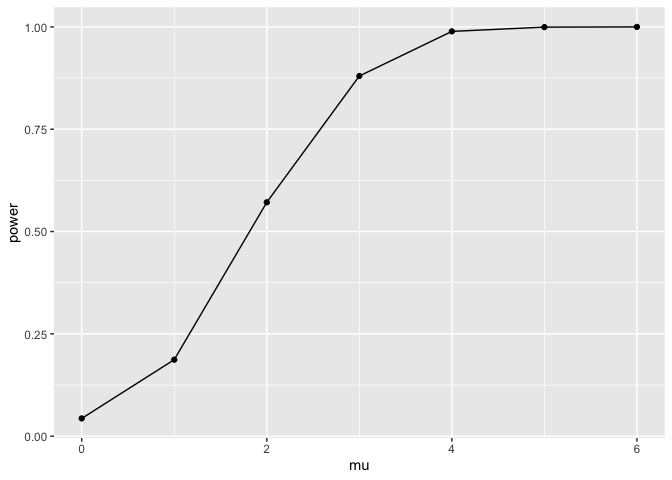
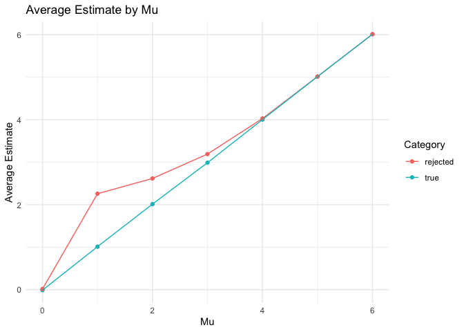

p8105_hw2_KAB2310
================
Kamiah Brown
2024-10-01

## This is my submission for Homework 5.

#### Set up

``` r
library(tidyverse)
```

    ## ── Attaching core tidyverse packages ──────────────────────── tidyverse 2.0.0 ──
    ## ✔ dplyr     1.1.4     ✔ readr     2.1.5
    ## ✔ forcats   1.0.0     ✔ stringr   1.5.1
    ## ✔ ggplot2   3.5.1     ✔ tibble    3.2.1
    ## ✔ lubridate 1.9.3     ✔ tidyr     1.3.1
    ## ✔ purrr     1.0.2     
    ## ── Conflicts ────────────────────────────────────────── tidyverse_conflicts() ──
    ## ✖ dplyr::filter() masks stats::filter()
    ## ✖ dplyr::lag()    masks stats::lag()
    ## ℹ Use the conflicted package (<http://conflicted.r-lib.org/>) to force all conflicts to become errors

``` r
library(dplyr)
library(readxl)
library(broom)
```

## Problem 1

#### Function

``` r
bday_sim = function(n) {
  sample = sample(1:365, size = n, replace = TRUE)
duplicates = length(unique(sample)) < n
return(duplicates)
}

bday_sim(7)
```

    ## [1] FALSE

``` r
#### Running function 1000 times for each group size between 2 and 50
bday_sim = expand_grid(
    iter = 1:10000,
    n = 2:50) |>
  mutate(res = map_lgl(n, bday_sim)) |> 
  group_by(n) |> 
  summarize(
    prob = mean(res)
  )
```

#### Probability as a function (Shared Birthday) of group size

``` r
bday_sim |>
  ggplot(aes(x = n, y = prob)) +
  geom_point() +
  geom_line() +
  labs(
    title = "Probability of Shared Birthday vs Group",
    x = "Group Size",
    y = "Probability"
  ) +
  theme_minimal()
```

<!-- -->

### Comments

The plot demonstrates that as the group size increases, the probability
of at least two people sharing a birthday rises quickly at first and
then levels off as it approaches 1, highlighting a nonlinear
relationship. While smaller groups show a rapid increase in the
likelihood of shared birthdays, the rate of increases slows signficantly
for larger group sizes (beyond 30), where the probability is approaching
1.

## Problem 2

``` r
n = 30
sigma = 5

sim_power = function(mu){
  
  tibble(
    x = rnorm(n, mu, sigma)) |> 
      summarize(
        tidy(t.test(x, mu = 0, conf.level = 0.95))) |> 
    select(estimate, p.value)
}

# Generate 5000 data sets from the model
sim_result = expand_grid(
  mu = 0:6,
  iter = 1:5000) |> 
  mutate(samp_res = map(mu, sim_power)) |> 
  unnest(samp_res)
```

#### Plot showing the proportion of times the null was rejected

``` r
sim_result |> 
  group_by(mu) |> 
  summarize(
    power = mean(p.value < 0.05)
  ) |> 
  ggplot(aes(x = mu, y = power)) +
  geom_point() +
  geom_line()
```

<!-- -->

### Comments

When the effect size, mu, increases, the power of the test also
increases. This means that the likelihood of correctly rejecting the
null hypothesis rises as mu deviates further from 0.

#### Plot showing the average estimate of mu and an overlay on the graph showing the average estimate of mu only in samples for which the null was rejected.

``` r
df1 = sim_result |> 
  group_by(mu) |> 
  summarize(avg = mean(estimate))  |> 
  mutate(category = "true")
```

``` r
df2 = sim_result |> 
  filter(p.value < 0.05) |> 
  group_by(mu) |> 
  summarize(avg = mean(estimate)) |> 
  mutate(category = "rejected")

#Combining data frames
df <- rbind(df1, df2)

#Plot 2
ggplot(df, aes(x = mu, y = avg, color = category)) +
  geom_point() +  
  geom_line() +  
  labs(
    title = "Average Estimate by Mu",
    x = "Mu",
    y = "Average Estimate",
    color = "Category"
  ) +
  theme_minimal()
```

<!-- -->

### Comments

The sample average of 𝜇̂ across tests for which the null is rejected
approximately equal to the true value of 𝜇because, when the sample is
significantly different from the null distribution, we are more likely
to reject the null hypothesis. However, the sample average of 𝜇 in such
cases approximates the true value of 𝜇 more closely as the true value of
𝜇 increases.

# Problem 3

``` r
#Read and created the city_state variable.
homicide_df = 
  read_csv("homicide-data.csv") |>
  mutate(city_state = str_c(city, state, sep = ", "))
```

    ## Rows: 52179 Columns: 12
    ## ── Column specification ────────────────────────────────────────────────────────
    ## Delimiter: ","
    ## chr (9): uid, victim_last, victim_first, victim_race, victim_age, victim_sex...
    ## dbl (3): reported_date, lat, lon
    ## 
    ## ℹ Use `spec()` to retrieve the full column specification for this data.
    ## ℹ Specify the column types or set `show_col_types = FALSE` to quiet this message.

``` r
head(homicide_df)
```

    ## # A tibble: 6 × 13
    ##   uid   reported_date victim_last victim_first victim_race victim_age victim_sex
    ##   <chr>         <dbl> <chr>       <chr>        <chr>       <chr>      <chr>     
    ## 1 Alb-…      20100504 GARCIA      JUAN         Hispanic    78         Male      
    ## 2 Alb-…      20100216 MONTOYA     CAMERON      Hispanic    17         Male      
    ## 3 Alb-…      20100601 SATTERFIELD VIVIANA      White       15         Female    
    ## 4 Alb-…      20100101 MENDIOLA    CARLOS       Hispanic    32         Male      
    ## 5 Alb-…      20100102 MULA        VIVIAN       White       72         Female    
    ## 6 Alb-…      20100126 BOOK        GERALDINE    White       91         Female    
    ## # ℹ 6 more variables: city <chr>, state <chr>, lat <dbl>, lon <dbl>,
    ## #   disposition <chr>, city_state <chr>

The raw data set have 12 variables and 52179 observations. The variables
in the dataset includes uid, reported_date, victim_last, victim_first,
victim_race, victim_age, victim_sex, city, state, lat, lon, disposition.

``` r
homicide_sum <- homicide_df |>
  group_by(city_state) |>
  summarize(
    total_homicides = n(),
    unsolved_homicides = sum(disposition %in% c("Closed without arrest", "Open/No arrest"))
  )

head(homicide_sum)
```

    ## # A tibble: 6 × 3
    ##   city_state      total_homicides unsolved_homicides
    ##   <chr>                     <int>              <int>
    ## 1 Albuquerque, NM             378                146
    ## 2 Atlanta, GA                 973                373
    ## 3 Baltimore, MD              2827               1825
    ## 4 Baton Rouge, LA             424                196
    ## 5 Birmingham, AL              800                347
    ## 6 Boston, MA                  614                310

#### Estimate the proportion of homicides that are unsolved

``` r
baltimore_homi <- homicide_sum |>
  filter(city_state == "Baltimore, MD")
prop.test(n = pull(baltimore_homi,total_homicides), 
          x = pull(baltimore_homi,unsolved_homicides)) |>
  broom::tidy() |>
  select(estimate, conf.low, conf.high)
```

    ## # A tibble: 1 × 3
    ##   estimate conf.low conf.high
    ##      <dbl>    <dbl>     <dbl>
    ## 1    0.646    0.628     0.663

### Run prop.test for each of the cities in your dataset, and extract both the proportion of unsolved homicides and the confidence interval for each

``` r
cities_homi = homicide_sum |> 
  mutate(test_result = purrr::map2(unsolved_homicides, total_homicides, ~ {
    if (.y >= 30) {
      prop.test(x = .x, n = .y)
    } else {
      binom.test(x = .x, n = .y)
    }
  })) %>%
  mutate(test_result = purrr::map(test_result, broom::tidy)) %>%
  unnest(test_result) %>%
  select(city_state, estimate, conf.low, conf.high)

cities_homi
```

    ## # A tibble: 51 × 4
    ##    city_state      estimate conf.low conf.high
    ##    <chr>              <dbl>    <dbl>     <dbl>
    ##  1 Albuquerque, NM    0.386    0.337     0.438
    ##  2 Atlanta, GA        0.383    0.353     0.415
    ##  3 Baltimore, MD      0.646    0.628     0.663
    ##  4 Baton Rouge, LA    0.462    0.414     0.511
    ##  5 Birmingham, AL     0.434    0.399     0.469
    ##  6 Boston, MA         0.505    0.465     0.545
    ##  7 Buffalo, NY        0.612    0.569     0.654
    ##  8 Charlotte, NC      0.300    0.266     0.336
    ##  9 Chicago, IL        0.736    0.724     0.747
    ## 10 Cincinnati, OH     0.445    0.408     0.483
    ## # ℹ 41 more rows

``` r
#I received an warning "Chi-squared approximation may be incorrect", so I modified using if/else statement and binom.test. 
```

\#Plot that shows the estimates and CIs for each city

``` r
cities_homi |>
  ggplot(aes(x = reorder(city_state, estimate), y = estimate)) +
  geom_bar(stat = "identity", fill = "lightblue") + 
  geom_errorbar(aes(ymin = conf.low, ymax = conf.high), width = 0.2) + 
  coord_flip() +
  labs(
    x = "City",
    y = "Proportion of Unsolved Homicides",
    title = "Proportion of Unsolved Homicides by City with Confidence Intervals"
  ) +
  theme_minimal()
```

<!-- -->
